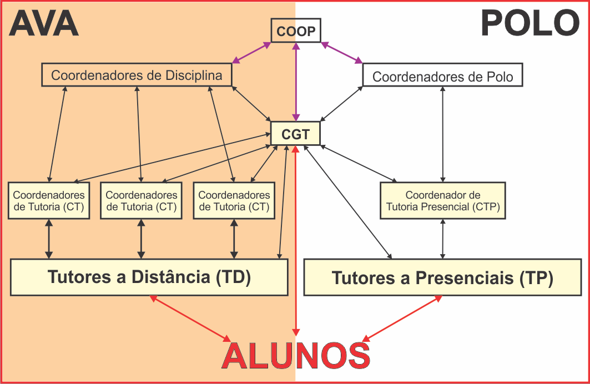
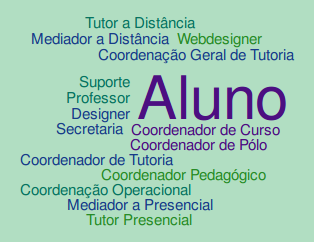

# Atores da Educação a Distância

A maioria de nós estudou no ensino presencial a maior parte de nossas vidas.
Naquela época, o principal Ator ou Papel era o do Professor. Mas será que na
Educação a distância é do mesmo jeito?

## Um curso com muitos alunos no presencial

Um colega meu de trabalho me contou que há vários anos foi fazer uma
pós-graduação no Canadá, e lá os professores (do presencial) davam aulas
maravilhosas. No entanto, era muito difícil de ter acesso a eles. Havia uma
hierarquia de ensino, o professor dava aula e existia um grupo de **tutores**
que tinha como responsabilidade tirar as dúvidas dos alunos. Um dia, quando meu colega
foi tirar uma dúvida com o professor, ele lhe fez a seguinte pergunta:

> "Você já conversou com um dos tutores antes?"

Este diálogo é importante porque, existe um limite na quantidade de alunos que
um único professor pode atender. Quanto mais alunos, mais difícil fica ele,
acompanhar a evolução dos alunos sozinho.

Quando o número de alunos de um curso fica muito grande, inevitavelmente
torna-se necessário adicionar intermediários que irão acompanhar o aluno em
seus estudos. Estes *intermediários* são os **tutores**.

Percebam que estes **tutores** serão **sempre necessários** quando o número de
alunos for grande. Caso o número de alunos seja pequeno, um professor apenas
poderá dar conta do serviço sozinho.

## Professor

Será que os professores da EAD possuem as mesmas funções dos 
professores do presencial?

O principal propósito do professor é facilitar o aprendizado do aluno. Na EAD,
o professor continua com a mesma função, no entanto, as ações necessárias para
facilitar o aprendizado são diferentes. Além disso, o grande número de alunos
requer a colaboração de uma equipe para atender as necessidades dos alunos.

## Atores no Sistema UAB

O sistema UAB concede bolsas para alguns atores envolvidos na EAD,
nesta seção apresentamos como as bolsas foram concedidas de acordo
com sua resolução.

| Papel                | 2006 | 2009 |
| -------------------- |:----:|:----:|
| Coordenador/Suplente  | X |  |
| Coordenador/Coordenador-adjunto|  | X |
| Coordenador de curso  |   | X |
| Coordenador de tutoria|   | X |
| Professor/Pesquisador | X | X |
| Coordenador de Pólo   | X | X |
| Tutor a Distância     | X |   |
| Tutor Presencial      | X |   |
| Tutor                 |   | X |

Na resolução de 2009 percebemos as seguintes alterações:

* Foram concedidas bolsas para os **Coordenador de tutoria**
e **Coordenador de curso**, não contemplados anteriormente.
* As bolsas de tutor a distância e presencial foram referenciadas
apenas como "Tutor".
* Nomenclatura de _Suplente_ passou a ser _Coordenador-adjunto_.

### RESOLUÇÃO/FNDE/CD/ No 044, DE 29 DE DEZEMBRO DE 2006

De acordo com a *RESOLUÇÃO/ FNDE/CD/ No 044, DE 29 DE DEZEMBRO DE 2006*, são concedidas
bolsas para os papeis a seguir:

* Coordenador/Suplente da UAB nas Instituições Federais de Ensino Superior - IFES
* Professor/Pesquisador
* Tutor a Distância
* Coordenador de Pólo
* Tutor Presencial

#### Coordenador/Suplente da UAB nas Instituições Federais de Ensino Superior - IFES

Professor ou pesquisador designado/indicado pelas instituições vinculadas
ao Sistema UAB, que atuará nas atividades de coordenação e apoio aos pólos
presenciais, e no desenvolvimento de projetos de pesquisa relacionados aos
cursos e programas implantados no âmbito do Sistema UAB.

#### Professor/Pesquisador
Professor ou pesquisador designado/indicado pelas
instituições vinculadas ao Sistema UAB, que atuará nas atividades típicas de
ensino, de desenvolvimento de projetos e de pesquisa, relacionadas aos cursos e
programas implantados no âmbito do Sistema UAB

#### Tutor a Distância
Participante dos cursos e programas da UAB, selecionado
pelas instituições vinculadas ao Sistema UAB, para o exercício das atividades
típicas de tutoria em educação a distância.

#### Coordenador de Pólo
Professor da rede pública na educação básica, que será responsável pela
coordenação do pólo de apoio presencial.

#### Tutor Presencial
Professor da rede pública estadual ou municipal, da cidade
sede do pólo, selecionado pelas Instituições de Ensino Superior vinculadas ao
Sistema UAB.

### RESOLUÇÃO CD/FNDE No 26, DE 5 DE JUNHO DE 2009

De acordo com a RESOLUÇÃO CD/FNDE No 26, DE 5 DE JUNHO DE 2009, são concedidas
bolsas para os papeis a seguir:

* Coordenador/Coordenador-adjunto da UAB
* Coordenador de curso
* Coordenador de tutoria
* Professor–pesquisador
* Tutor
* Coordenador de pólo

#### Coordenador/Coordenador-adjunto da UAB
Professor que atuará nas atividades de coordenação e apoio aos pólos
presenciais e no desenvolvimento de projetos de pesquisa relacionados aos cursos e programas
implantados no âmbito do Sistema.

#### Coordenador de curso nas instituições públicas de ensino superior (IPES)
Professor ou
pesquisador designado/indicado pelas IPES vinculadas ao Sistema UAB, que atuará nas atividades
de coordenação de curso implantado no âmbito do Sistema UAB e no desenvolvimento de projetos
de pesquisa relacionados aos cursos.

#### Coordenador de tutoria nas instituições públicas de ensino superior (IPES)
Professor ou pesquisador designado/indicado pelas IPES vinculadas ao Sistema UAB,
que atuará nas atividades de coordenação de tutores dos cursos implantados no âmbito
do Sistema UAB.

#### Professor–pesquisador
Professor ou pesquisador designado ou indicado pelas IPES
vinculadas ao Sistema UAB, que atuará nas atividades típicas de 
ensino, de desenvolvimento de projetos e de pesquisa, relacionadas 
aos cursos e programas implantados no âmbito do Sistema UAB.

#### Tutor
Profissional selecionado pelas IPES vinculadas ao Sistema UAB 
para o exercício das atividades típicas de tutoria.

#### Coordenador de pólo

Professor da rede pública, na educação básica ou superior, responsável pela coordenação do pólo de apoio presencial.

## Atores no LANTE

Os atores no LANTE podem ser observados nos slides
apresentados na Aula Inaugural:

### Coordenação Operacional (COOP)

> A gestão dos cursos é feita pela Coordenação Operacional.
> O contato com as secretarias dos dois cursos, assim como as
inscrições e cancelamentos de disciplinas são feitos no
ambiente da Coordenação Operacional, na Plataforma
MOODLE.
> O canal de comunicação com os tutores responsáveis pelos
polos também é feito no ambiente da Coordenação Operacional.

### Coordenação Geral de Tutoria (CGT)

> A gestão dos tutores e coordenadores de tutoria é feita pela
Coordenação Geral de Tutoria. Ela é responsável pela escolha,
formação, acompanhamento e avaliação de todos os tutores a
distância e presenciais e coordenadores de tutoria das
disciplinas.

> A CGT está vinculada à COOP e acompanha todo o processo
tutorial, em um trabalho colaborativo com os coordenadores de
disciplina, com as coordenações dos Cursos e com os
coordenadores de polo.

### Coordenador do Curso PIGEAD

Nosso coordenador é Professor Dr. Celso Costa.

### Suporte

Embora não costuma ser consultado com frequência pelos alunos,
o suporte, também pode ser acionado para tratar sobre problemas
na plataforma Moodle, através do seguinte e-mail: suporte@lante.uff.br.

### Secretarias dos Cursos

É através de secretaria que é possível solicitar o comprovante
de matrícula: pigead@lante.uff.br.

### Análise dos papeis do LANTE

Ao observar atentamente a estrutura do LANTE e a nomenclatura
utilizada podemos observar:

- Ausência do papel *Professor*
- Não há comunicação entre *Aluno* e *Coordenadores de Disciplinas*
- Existência de vários coordenadores de tutoria

Para compreender a estrutura do LANTE, vou analisar comparando
com a estrutura da UFPB Virtual, onde trabalho, lá temos a seguinte estrutura:

    Alunos > Tutores > Professor
    Tutores > Coordenador de Tutoria
    Professores > Coordenador do Curso
    Professores > Coordenador Pedagógico
    Coordenador de Tutoria > Coordenador do Curso
    Suporte
    Os cursos são semestrais, com disciplinas em paralelo

Este modelo difere do LANTE nos seguintes aspectos:

- Existe o Professor
- Só há um Coordenador de Tutoria
- Não existe Coordenadores de Disciplinas
- Disciplinas em paralelo

#### Análise preliminar

**NOTA**: Preciso de mais evidências para conhecer
como eles funcionam para realizar uma análise.

- O professor é chamado de Coordenador da Disciplina
- O que faz o coordenador de tutoria no lante?
- O Coordenação Geral de Tutoria do LANTE equivale ao Coordenador de Tutoria da UFPB Virtual?

Lista dos atores, independente do sistema:

[Resol44_2006]: http://www.uab.capes.gov.br/images/stories/downloads/legislacao/resolucaofnde.pdf "Resolução 44 de 2006"
[Resol26_2009]: http://www.uab.capes.gov.br/images/stories/downloads/legislacao/resolucao_fnde_n26.pdf "Resolução 26 de 2009"
